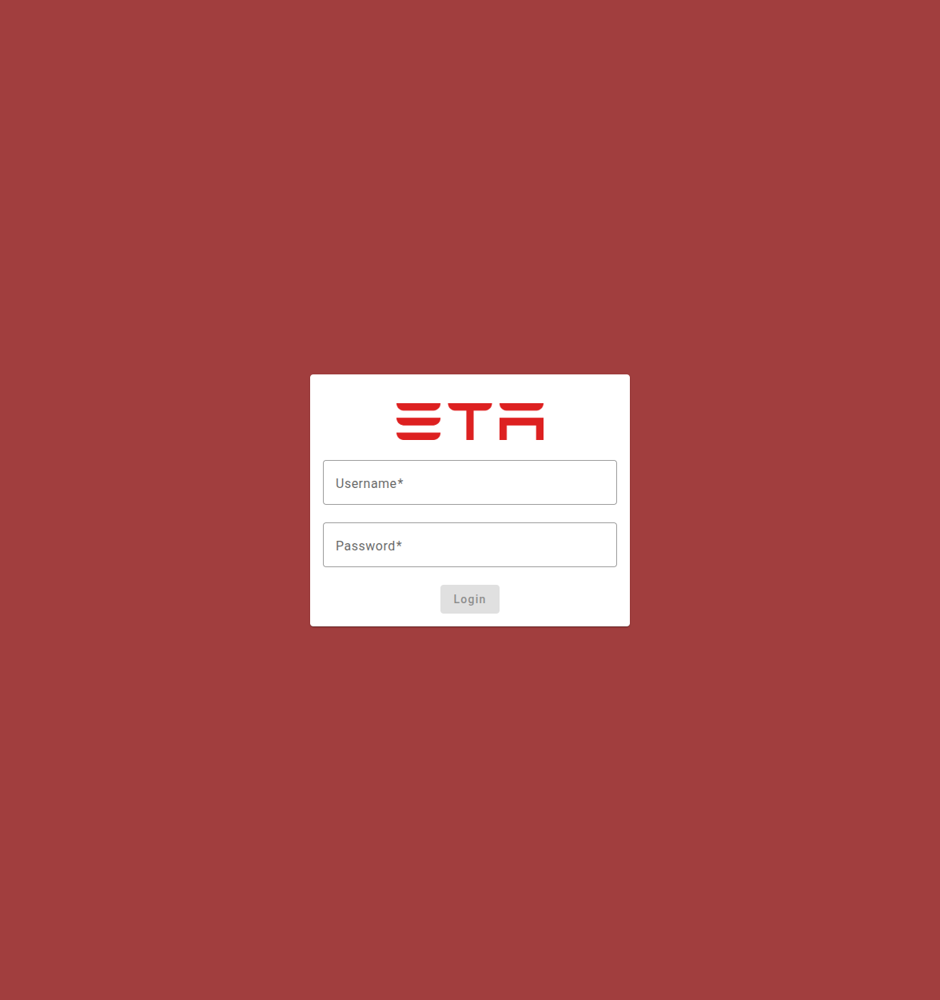
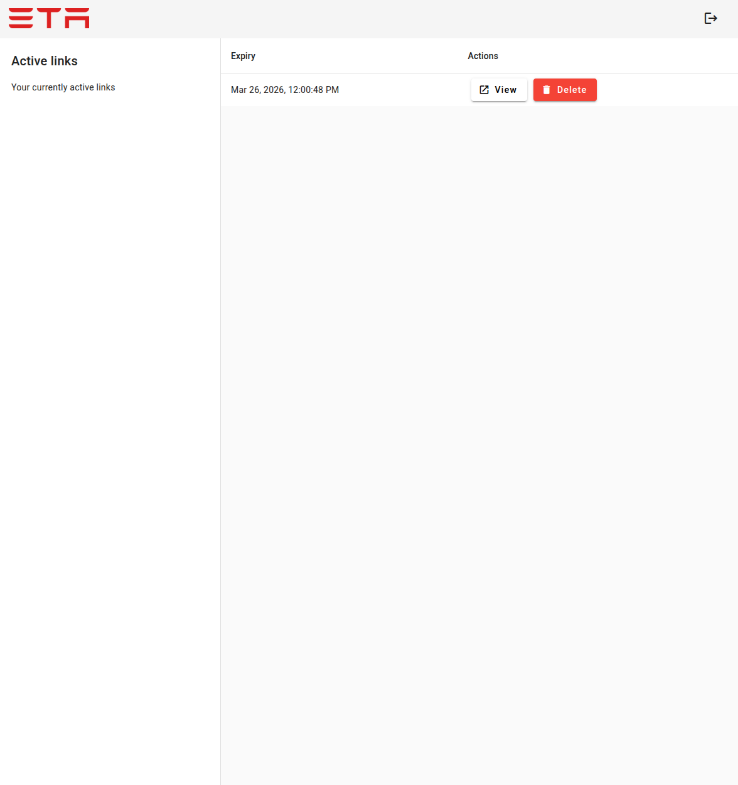
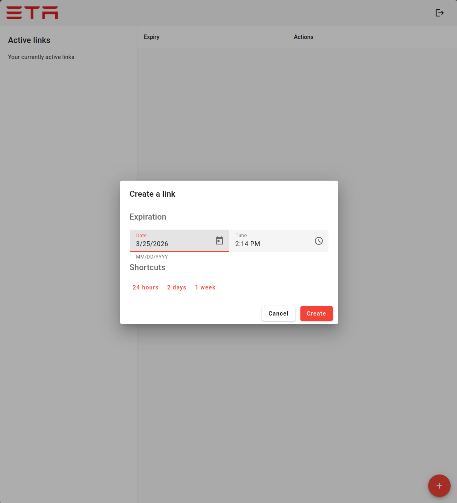
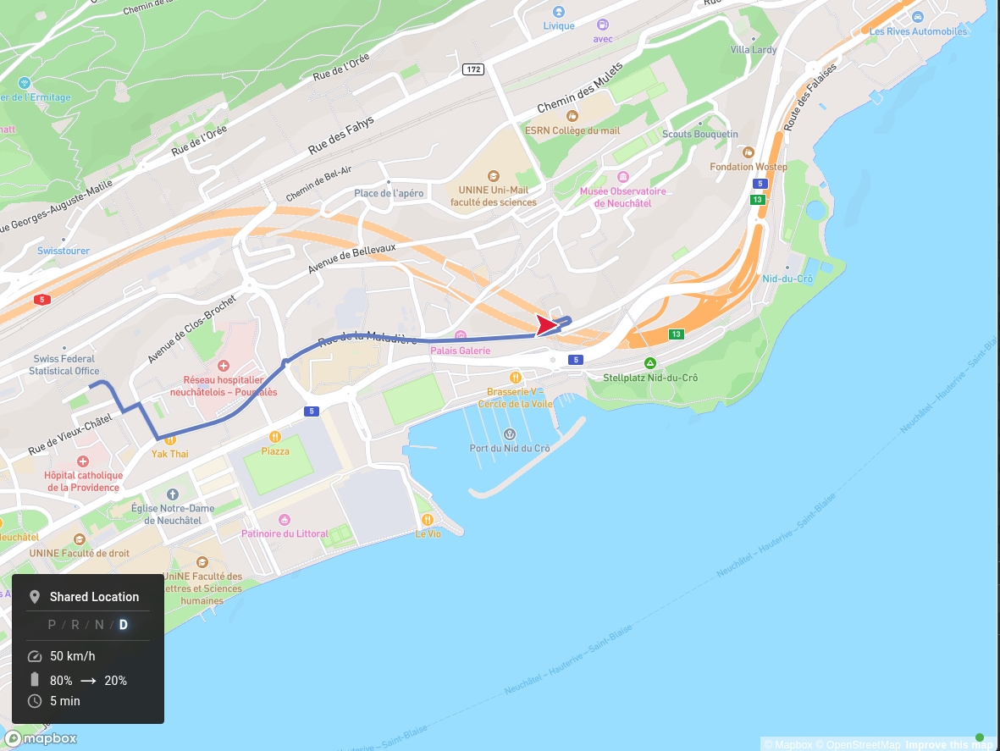

# About
TeslaETA is a Flask + Angular service that lets you share your Tesla's live location, route, and ETA via an expiring public link. It receives real-time vehicle data from [TeslaMate](https://github.com/adriankumpf/teslamate) over MQTT and streams updates to viewers via WebSockets.

There is a single admin user whose password is configured via an environment variable.
The admin user can create time-limited share links (each bound to a specific car ID). Recipients open the link and see the car's position on a Mapbox map together with live stats (destination, speed, battery level, estimated battery at arrival, and minutes to arrival).

## Current Features
- All mobile responsive

### Map View (public via share UUID)
- Full-screen Mapbox GL map with live car position and directional heading arrow
- Active route to destination
- Live stats overlay: destination, gear state, speed (km/h), battery level, estimated battery at arrival, minutes to arrival
- Real-time updates streamed over WebSocket (push model via MQTT)

### Admin Interface (JWT-authenticated Angular SPA)
- View and manage all active share links
- Create new share links with configurable expiry and car ID
- Delete existing share links

# Screenshots





# Architecture
- **nginx** serves the Angular SPA and reverse-proxies `/api/` and `/ws/` to Flask.
  - It's currently in a single Docker image, but can and most probably will be separated later
- **Flask (Python 3.12)** handles REST API, JWT authentication, share management, and WebSocket streaming.
- **Angular 18** frontend (Material UI + Mapbox GL JS) for the admin interface and the public viewer.
- **TeslaMate** sends vehicle telemetry to an MQTT broker; Flask subscribes and pushes state to connected WebSocket clients.
- **SQLite** stores share links and the admin user (persisted via a Docker volume at `/data`).


# Setup & running it

## Prerequisites
- [TeslaMate](https://github.com/adriankumpf/teslamate) running and publishing to an MQTT broker reachable by TeslaETA.
- A free [Mapbox](https://account.mapbox.com/access-tokens/) account and access token.
- Docker (recommended) or Python 3.12 + Node 24 for a manual setup.

## Environment variables

Copy `.env_sample` to `.env` and fill in the values. This file must be present alongside `docker-compose.yml` (or exported in the shell for a manual run).

| Variable                    | Example                          | Required | Description |
|-----------------------------|----------------------------------|----------|-------------|
| `PORT`                      | `5051`                           | N        | Internal Flask port (default: `5051`, should not be changed if using the Docker image) |
| `API_URL`                   | `http://localhost:8080    `      | Y        | API url pointing to the Python app (without /api/) |
| `DATA_DIR`                  | `/data/`                         | N        | Path where the SQLite database is stored (default: `/data/`) |
| `SECRET_KEY`                | `RANDOMLY_GENERATED_STRING`      | Y        | Flask secret key |
| `JWT_SECRET`                | `ANOTHER_RANDOM_STRING`          | Y        | Secret used to sign JWT tokens |
| `ADMIN_PASSWORD`            | `YOUR_ADMIN_PASSWORD`            | Y        | Plaintext password for the `admin` user |
| `MAPBOX_TOKEN`              | `pk.eyJ1Ijoi...`                 | Y        | Mapbox public access token (used by both Flask and Angular) |
| `BACKEND_PROVIDER`          | `teslamate-mqtt`                 | Y        | Must be `teslamate-mqtt` |
| `BACKEND_PROVIDER_HOSTNAME` | `mosquitto` or `192.168.1.10`    | Y        | Hostname of the MQTT broker |
| `BACKEND_PROVIDER_CAR_ID`   | `1`                              | Y        | TeslaMATE car ID to subscribe to |
| `MQTT_PORT`                 | `1883`                           | N        | MQTT broker port (default: `1883`) |
| `MQTT_USERNAME`             | `myuser`                         | N        | MQTT broker username (if required) |
| `MQTT_PASSWORD`             | `mypassword`                     | N        | MQTT broker password (if required) |
| `TZ`                        | `Europe/Berlin`                  | Y        | Timezone for the container |

> **Mapbox token**: generate one at [account.mapbox.com/access-tokens](https://account.mapbox.com/access-tokens/). A free account is sufficient.

## Option 1 — Docker (recommended)

### Minimal docker-compose (TeslaETA only)
Use this if you already have TeslaMate and an MQTT broker running elsewhere.

```yaml
services:
  teslaeta:
    image: ghcr.io/Zegorax/teslaeta:latest
    volumes:
      - ./data/:/data/
    env_file:
      - .env
    ports:
      - "8080:80"
```

The container exposes nginx on port **80** internally. Map it to the host port you prefer (e.g. `8080:80`).

### Full stack docker-compose (TeslaMate + MQTT + TeslaETA)
The repository ships a `docker-compose.yml` that starts all required services for local development:

| Service      | Image                          | Host port | Purpose |
|--------------|--------------------------------|-----------|---------|
| `teslaeta`   | built from local `Dockerfile`  | `8080`    | nginx + Angular SPA + Flask API |
| `teslamate`  | `teslamate/teslamate:latest`   | `4000`    | TeslaMate web UI |
| `database`   | `postgres:16`                  | —         | PostgreSQL for TeslaMate |
| `mosquitto`  | `eclipse-mosquitto:2`          | `1883`    | MQTT broker |

```bash
docker compose up -d --build
```

### Angular runtime environment injection
At container startup, `docker_init.sh` uses `envsubst` to inject `API_URL` and `MAPBOX_TOKEN` into
`static_angular/assets/env.js` (generated from `static_angular/assets/env.template.js`). This means the
Angular app reads its configuration **at runtime** from `window.env`, so the Docker image is environment-agnostic
and no rebuild is needed when configuration changes.

> **Important**: `API_URL` and `MAPBOX_TOKEN` must be set as environment variables in the container (e.g. via
> `.env` / `env_file:`) for the substitution to work correctly.

## Option 2 — Running manually

### Backend (Python)
```bash
pip install -r requirements.txt
cp .env_sample .env
## Make changes to your .env ##
flask db upgrade
python -m app run --host=0.0.0.0 --port=5051
```

### Frontend (Angular)
The Angular app needs to know the API URL and Mapbox token at **build time for development** or at **runtime for production**.

**Development server** — edit `frontend/src/environments/environment.development.ts` and set `apiUrl` and `mapboxToken`, then:
```bash
cd frontend
npm install
npm run start          # serves on http://localhost:4200
```

**Production build** — environment variables are **not** baked into the build; they are injected at runtime
via `frontend/src/assets/env.template.js`. Before starting the app, ensure `API_URL` and `MAPBOX_TOKEN` are
exported in your shell, then run `docker_init.sh` (or perform the `envsubst` step manually):
```bash
export API_URL=https://your-domain.com
export MAPBOX_TOKEN=pk.eyJ1Ijoi...
envsubst < static_angular/assets/env.template.js > static_angular/assets/env.js
```

## Initial Login
Navigate to `http://<your-host>/admin` and log in with username `admin` and the password you set in `ADMIN_PASSWORD`.
